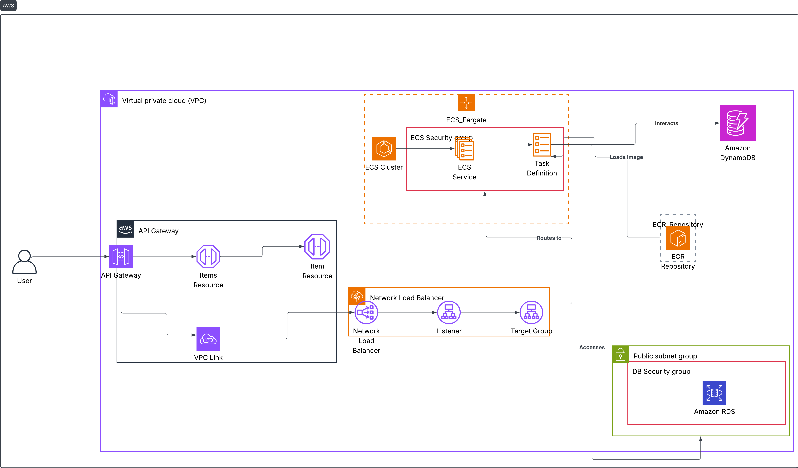

## Práctica de Aula 4 — Computación en la Nube

Esta es la solución de partida para la práctica de aula 4 de la asignatura de Computación en la Nube (EII-ULPGC). Proporciona una API REST de gestión de tickets desarrollada con Flask y preparada para desplegarse en AWS sobre ECS Fargate, con entrada por API Gateway y balanceo mediante un Network Load Balancer. La idea es que el alumno comprenda la arquitectura para en la parte bis realizar el desacoplamiento y demostración de la funcionalidad

### Diagrama de arquitectura



### Componentes principales

- **API Gateway (REST)**: expone los recursos `items` e `item` y enruta al backend vía VPC Link. Protegido con API Key.
- **VPC Link + NLB**: el VPC Link conecta API Gateway con un Network Load Balancer interno que apunta al servicio de ECS.
- **ECS Fargate**: ejecuta el contenedor de la app Flask definido en `Dockerfile` y `main.yml`.
- **Bases de datos**:
  - **PostgreSQL (Amazon RDS)** en el VPC, con SG de acceso al puerto 5432.
  - **Amazon DynamoDB** como alternativa NoSQL de tabla única.
- **Amazon ECR**: repositorio para la imagen del contenedor.

### Estructura del proyecto

- `app/main.py`: aplicación Flask con endpoints y CORS.
- `app/models/ticket.py`: modelo `Ticket` con validación Pydantic.
- `app/db/db.py`: interfaz abstracta de base de datos.
- `app/db/postgres_db.py`: implementación PostgreSQL.
- `app/db/dynamodb_db.py`: implementación DynamoDB.
- `app/db/factory.py`: selecciona la implementación según `DB_TYPE`.
- `Dockerfile`: imagen de la aplicación.
- `requirements.txt`: dependencias Python.
- `main.yml`: plantilla CloudFormation para API Gateway + VPC Link + NLB + ECS Fargate.
- `db_postgres.yml`: plantilla para RDS PostgreSQL.
- `db_dynamodb.yml`: plantilla para la tabla DynamoDB mínima.
- `ecr.yml`: plantilla para el repositorio ECR.
- `postgres.sql`: script SQL equivalente para crear la tabla localmente.
- `frontend.html`: HTML básico para probar la API vía API Gateway.

### API

- **POST** `/items`: crea un ticket.
- **GET** `/items`: lista de tickets.
- **GET** `/items/{ticket_id}`: obtiene un ticket.
- **PUT** `/items/{ticket_id}`: actualiza un ticket.
- **DELETE** `/items/{ticket_id}`: borra un ticket.
- **GET** `/health`: comprobación de vida.

Las respuestas de error gestionan validación (`pydantic`), integridad/operación de PostgreSQL y errores de DynamoDB.

### Variables de entorno

- **DB_TYPE**: `postgres` (por defecto) o `dynamodb`.
- Si `DB_TYPE=postgres`:
  - **DB_HOST**, **DB_NAME**, **DB_USER**, **DB_PASS**.
- Si `DB_TYPE=dynamodb`:
  - **DB_DYNAMONAME**: nombre de la tabla (por defecto `tickets`).

### Ejecución local (opcional)

```bash
python -m venv .venv && source .venv/bin/activate
pip install -r requirements.txt
# Ejemplo usando PostgreSQL local
export DB_TYPE=postgres DB_HOST=localhost DB_NAME=ticketsdb DB_USER=postgres DB_PASS=postgres
python app/main.py
# La API quedará en http://localhost:8080
```

### Contenedor

```bash
# Construir
docker build -t tickets-app:latest .
# Ejecutar
docker run --rm -p 8080:8080 \
  -e DB_TYPE=postgres \
  -e DB_HOST=host.docker.internal -e DB_NAME=ticketsdb -e DB_USER=postgres -e DB_PASS=postgres \
  tickets-app:latest
```

### Despliegue en AWS (CloudFormation)

Orden recomendado de plantillas:

1. `ecr.yml` → crea el repositorio y subir la imagen.
2. `db_postgres.yml` o `db_dynamodb.yml` → crea la base de datos elegida.
3. `main.yml` → despliega VPC Link, NLB, ECS Fargate, API Gateway y enlaza la imagen y variables.

Parámetros clave de `main.yml`:

- **ImageName**: `<repo>:<tag>` en ECR.
- **VpcId**, **SubnetIds**: VPC y subredes existentes.
- **DBType**: `postgres` o `dynamodb`.
- Campos de DB correspondientes: `DBHost`, `DBName`, `DBUser`, `DBPass` o `DBDynamoName`.

### Probar con `frontend.html`

`frontend.html` es una página estática que consume los endpoints del API Gateway usando `fetch` y la cabecera `x-api-key`.

Uso rápido:

1. Abrir el archivo `frontend.html` en el navegador (doble clic o `file:///...`).
2. En el modal de configuración inicial, introducir:
   - **API URL**: la URL del Stage (por ejemplo, `https://<rest-api-id>.execute-api.us-east-1.amazonaws.com/prod`).
   - **API Key**: el valor de la API Key creada por `main.yml`.
3. Pulsar “Conectar”.
4. Crear/editar/mover tickets en el tablero. Las operaciones llaman a `POST /items`, `GET /items`, `PUT /items/{id}` y `DELETE /items/{id}` del API Gateway.

Notas:

- La configuración (URL y API Key) se guarda en `localStorage` del navegador.
- Si la API Key no es válida o el CORS falla, la app mostrará un mensaje de error.

### Notas

- La región de las prácticas es `us-east-1`.
- El contenedor expone el puerto 8080 y el NLB escucha en el mismo puerto.
- Se deja tanto el grupo de seguridad de la tarea de ECS como de la BBDD abierto para que los alumnos puedan acceder desde fuera para validar su trabajo. Permitiéndoles debuggear de forma sencilla.
